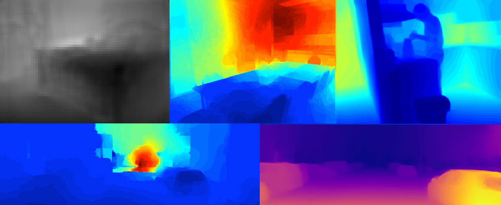

## Depth Estimation

This project is a real-time depth estimation application using a neural network model. It captures video from a webcam, processes each frame to estimate depth, and displays both the original image and the depth map.

[](#)

### Project Structure

```sh
    datasets/
        midas_v21_small_256.pt
    main.py
```

### Overview

- **numpy** and **cv2** (OpenCV) imported for numerical operation and image processing
- Loads the neural network model using OpenCV's **cv2.dnn.readNet**
- Sets the backend and target to **CUDA** to utilize GPU for faster processing.
- Opens the webcam for capturing real-time video frames.
- **main loop**
  - Reads frames from the webcam.
  - Converts the image to RGB format.
  - Creates a blob from the input image suitable for the MiDaS v2.1 Small model.
  - Sets the blob as input to the model.
  - Performs a forward pass to get the depth map.
  - Resizes and normalizes the output depth map.
  - Calculates and displays the FPS.
  - Displays the original image and the depth map.
  - Exits the loop if the 'q' key is pressed.

The application will open the webcam, process the video frames to estimate depth, and display both the original image and the depth map in real-time.

### Dependencies

- **OpenCV with DNN module**
- **NumPy**

This project leverages the **MiDaS v2.1 Small** model for depth estimation and uses GPU acceleration for real-time performance.

<h3 align="left">Languages and Tools:</h3>
<p align="left"> 
  <a href="https://opencv.org/" target="_blank" rel="noreferrer" style="margin-right:10px"> 
     
  </a> 
  <a href="https://www.python.org" target="_blank" rel="noreferrer"   style="margin-right:10px"> 
     
  </a>
  <a href="https://scikit-learn.org/" target="_blank" rel="noreferrer"> 
     
  </a></p>
